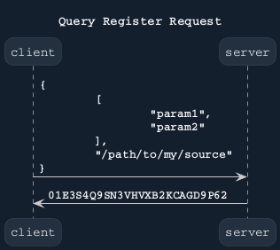

# Dev.to related tricks

## PlantUML Theme

```plantuml
@startuml

!define Background   #141F2D
!define Participant  #22303F
!define Border       #424A54
!define Foregound    #CCCCCC

skinparam Shadowing false
skinparam roundcorner 20
skinparam backgroundColor Background
skinparam Arrow {
  Color Foregound
  FontColor Foregound
  FontStyle Bold
}
skinparam Default {
  FontName Courier
  FontColor Foreground
}
skinparam sequence {
  LifeLineBorderColor Foreground
}
skinparam participant {
  BackgroundColor Participant
  BorderColor Border
  FontColor Foreground
}

title Query Register Request

participant client as c
participant server as s

c -> s : {\n\t[\n\t\t"param1",\n\t\t"param2"\n\t],\n\t"/path/to/my/source"\n}
s -> c : 01E3S4Q9SN3VHVXB2KCAGD9P62

@enduml
```
